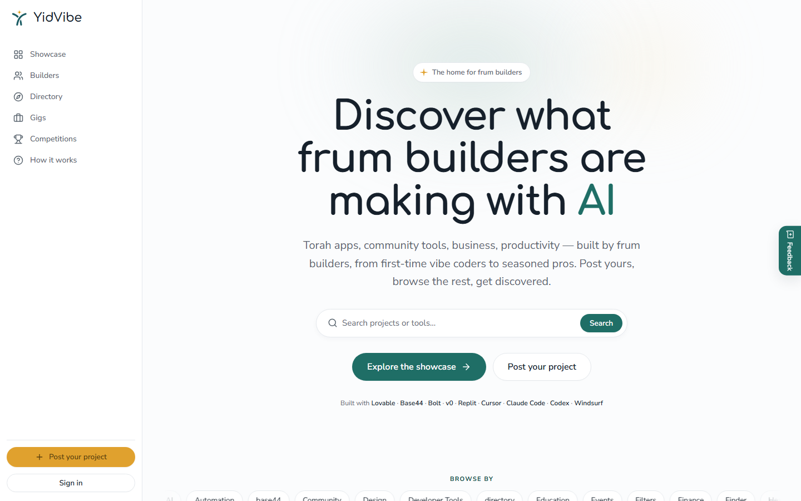

# YidVibe

Full-stack community marketplace for AI builders—profiles, gigs, showcases, competitions, and events.

[Visit YidVibe](https://yidvibe.com/)

## The problem

Independent AI builders often ship in public but lack one place to present their work, find collaborators or paid opportunities, and participate in a focused local community. YidVibe brings those activities into one product instead of scattering them across chat groups, social feeds, and generic job boards.

## The product

YidVibe is a multi-sided marketplace built around builder identity and shipped work:

- **Showcase** — publish projects, browse by tool or tag, upvote, and discuss
- **Builder profiles** — maintain a public portfolio, skills, tools, and availability
- **Directory** — search and filter community members
- **Gigs** — post work, apply, review applicants, and use private message threads
- **Competitions** — publish challenges, accept entries, and select a winner
- **Events** — share community meetups and gatherings

## Architecture

    Next.js 15 application
    ├─ Server Components and route handlers
    ├─ Supabase SSR authentication
    ├─ Postgres data model and migrations
    ├─ Row Level Security policies
    ├─ Supabase Storage for uploaded media
    └─ Tailwind CSS and reusable UI components

The application uses the Next.js App Router with TypeScript and React 19. Supabase provides Postgres, Google authentication, and storage; server and browser clients are separated through @supabase/ssr.

## Security model

- Row Level Security is enabled at the database layer.
- Authorization-sensitive actions are scoped to the signed-in user or resource owner.
- Gig conversations are limited to the poster and the relevant applicant.
- Privileged admin operations are isolated from browser clients.
- Environment-specific values are loaded from local or deployment configuration and are not committed.

The repository documents setup patterns; production security still depends on applying the migrations, configuring OAuth redirect allowlists, protecting server-only credentials, and reviewing Supabase security advisories for the deployed project.

## Core stack

- Next.js 15 and React 19
- TypeScript
- Supabase Postgres, Auth, Storage, and SSR helpers
- Tailwind CSS 4
- Radix UI primitives
- React Hook Form and Zod
- Vercel-compatible deployment

## Local setup

    npm ci
    cp .env.example .env.local
    npm run dev

Configure the values documented in .env.example, then follow [Google OAuth setup](docs/GOOGLE_OAUTH_SETUP.md) for Google sign-in.

## Verification

    npm run typecheck
    npm run build

Run these checks from a clean install before deployment. The repository's current verification result should be taken from a fresh run, not from historical build notes.

## AI-assisted workflow

The project was developed with an AI-first, human-directed workflow: requirements and architecture were decided intentionally, changes were reviewed in small scopes, and security-sensitive behavior was validated against the database and application boundaries. The reusable process is documented in [docs/AI_WORKFLOW.md](docs/AI_WORKFLOW.md).

## Deployment

The application is designed for Vercel with Supabase as its managed backend. Production configuration requires:

- Public Supabase URL and anonymous key
- Production site URL
- Matching Supabase and Google OAuth redirect URLs
- Applied database migrations and reviewed Row Level Security policies

## Repository note

This is a portfolio project and application source. No open-source license is granted by this repository.
